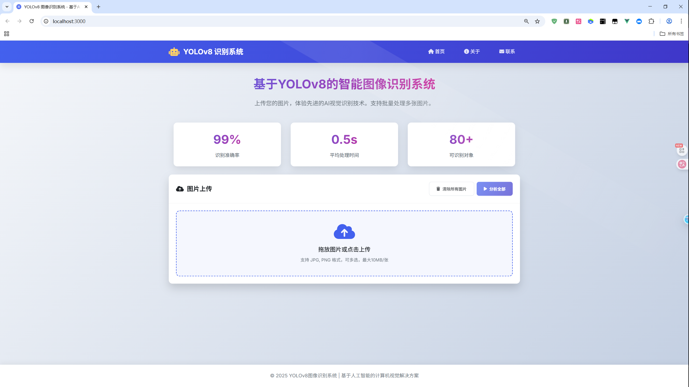

# YOLOv8 图像识别系统 - Vue3 + Vite 版本

## 📋 项目简介

这是我开发的**YOLOv8 智能图像识别系统**，一个基于深度学习的前后端分离Web应用，使用 Vue3 + Vite 构建。用户可以通过网页上传图片，系统会自动识别图片中的物体并用方框标记出来。

> **学习笔记**：这是我学习现代前端构建工具的实践项目，通过Vite体验了快速的开发服务器启动和热重载，并深入掌握了Vue3的组合式API开发模式。

---

## 🚀 快速开始

### 环境要求
- Node.js (版本 14.6.0 或以上，Vite要求)
- Python 3.8+ (后端服务)
- 现代浏览器（支持ES模块）

### 安装和运行

#### 1. 启动后端服务
```bash
# 进入后端目录
cd backend

# 安装Python依赖
pip install -r requirements.txt

# 启动后端服务（默认端口8000）
python main.py
```

#### 2. 启动前端服务
```bash
# 进入前端目录  
cd frontend

# 安装依赖
npm install

# 启动开发服务器（Vite默认端口5173）
npm run dev

# 或者使用 yarn
yarn dev
```

#### 3. 访问应用
打开浏览器访问：`http://localhost:5173`

---

## 🛠️ 技术栈

### 前端技术
- **框架**: Vue 3.x (使用 Composition API)
- **构建工具**: Vite (现代前端构建工具)
- **UI组件库**: Element Plus
- **HTTP请求**: Axios
- **样式**: CSS3 + 现代布局技术

### 后端技术  
- **框架**: FastAPI (Python)
- **AI模型**: YOLOv8 (目标检测)
- **图像处理**: OpenCV

### 开发工具
- **构建工具**: Vite (替代传统的Webpack)
- **包管理器**: npm 或 yarn
- **代码编辑器**: VS Code
- **版本控制**: Git

---

## 📁 项目主要结构

```
YOLOv8-fullstack-project/
├── frontend/                 # 前端代码（Vite项目）
│   ├── public/              # 静态资源（不会被Vite处理）
│   ├── src/
│   │   ├── components/      # Vue组件
│   │   │   ├── ImageUpload.vue    # 图片上传组件
│   │   │   └── ResultDisplay.vue  # 结果显示组件
│   │   ├── App.vue          # 根组件
│   │   ├── main.js          # 入口文件（Vite入口）
│   │   └── assets/          # 资源文件（会被Vite处理）
│   ├── index.html           # Vite的HTML模板
│   ├── package.json         # 项目配置和依赖
│   ├── vite.config.js       # Vite配置文件
│   └── .env.development     # 开发环境变量
├── backend/                 # 后端代码
│   ├── main.py             # 后端主文件
│   ├── requirements.txt    # Python依赖
│   └── yolov5n.onnx        # AI模型文件
└── README.md               # 项目说明
```

---

## ⚡ Vite 特色功能

### 快速冷启动
我利用Vite的浏览器原生ES模块导入特性，实现了秒级服务器启动。

### 即时热更新（HMR）
保持应用程序状态的同时快速更新模块，大大提升了我的开发体验。

### 优化的构建
使用Rollup打包，生成高度优化的静态资源，让我对生产环境的性能很有信心。

---

## ✨ 主要功能

### 🖼️ 图片上传
- 支持拖拽上传和点击上传
- 多图片批量上传
- 实时预览上传的图片
- 文件格式和大小验证

### 🔍 智能识别
- 基于YOLOv8模型的目标检测
- 自动识别80+种常见物体
- 实时显示识别进度和结果
- 支持批量图片处理

### 📊 结果展示
- 可视化检测框和标签
- 置信度显示和排序
- 响应式布局适配不同设备
- 清除和重新检测功能

---

## 🎯 学习收获

通过这个项目，我学习和实践了以下技能：

### Vue3 开发
- Vue3 Composition API 的使用和优势
- 响应式系统的深入理解（ref、reactive）
- 组合式函数的编写和使用
- 单文件组件（SFC）的现代化开发模式

### Vite 构建工具
- 现代前端构建工具的使用和配置
- 开发服务器的快速启动和热重载
- 生产环境的优化构建和分包策略

### 前端工程化
- 环境变量配置和管理
- 依赖管理和打包优化
- 开发和生产环境的不同配置

### 项目架构设计
- 前后端分离架构的理解和实践
- API 接口设计和数据格式约定
- 错误处理和用户体验优化

---

## ⚙️ Vite 配置说明

### vite.config.js 关键配置
```javascript
import { defineConfig } from 'vite'
import vue from '@vitejs/plugin-vue'

export default defineConfig({
  plugins: [vue()],
  server: {
    proxy: {
      '/api': {
        target: 'http://localhost:8000',
        changeOrigin: true,
        rewrite: (path) => path.replace(/^\/api/, '')
      }
    }
  },
  build: {
    outDir: 'dist',
    assetsDir: 'assets'
  }
})
```

### 环境变量配置
我使用 `.env.development` 和 `.env.production` 管理不同环境的配置。

---

## 🐛 遇到的问题和解决方案

### 1. Vue3 组合式API的学习曲线
**问题**：从Options API过渡到Composition API需要思维转变
**解决**：通过官方文档和实践项目逐步掌握，体会到了组合式API在逻辑复用方面的优势

### 2. 开发环境代理配置
**问题**：前端开发服务器需要代理后端 API 请求
**解决**：在 vite.config.js 中配置 server.proxy，解决了跨域问题

### 3. 静态资源处理
**问题**：图片等静态资源在开发和构建环境下的路径问题
**解决**：学习了Vite的静态资源处理规则，使用正确的导入方式

---

## 📦 构建和部署

### 开发环境
```bash
npm run dev
```

### 生产构建
```bash
npm run build
```

构建后的文件会在 `dist` 目录中，我可以部署到任何静态文件服务器。

### 预览生产版本
```bash
npm run preview
```

---

## 🔄 开发历程

### 第一阶段：项目搭建（2天）
- 使用 Vite 创建 Vue3 项目
- 配置开发环境和基本依赖
- 设计项目目录结构

### 第二阶段：核心功能开发（1周）
- 使用Composition API实现图片上传和预览功能
- 集成后端 API 接口
- 完成响应式界面布局

### 第三阶段：优化和完善（3天）
- 添加错误处理和加载状态
- 优化移动端适配
- 代码重构和性能优化

---

## 结果展示
**未连接后端的主页面**


**后端连接成功的主页面**



**后端页面**


**处理图片中**


**分析结果**


**清除上传图片**


**后端处理结果**


## 📈 后续计划

### 技术升级
- [ ] 深入使用TypeScript增强类型安全
- [ ] 添加 PWA 支持
- [ ] 探索Vue3更多新特性

### 功能扩展
- [ ] 用户系统和历史记录
- [ ] 实时摄像头检测功能
- [ ] 多模型切换支持

### 工程化改进
- [ ] 添加单元测试和 E2E 测试
- [ ] 配置 CI/CD 自动化部署
- [ ] 性能监控和分析

---

## 🌟 Vite 带来的优势

通过使用 Vite，我的项目获得了：
- **极快的服务器启动**：冷启动时间从 Webpack 的几十秒减少到几秒
- **高效的热更新**：无论项目规模多大，HMR 都能保持快速
- **优化的构建输出**：更小的打包体积和更好的缓存策略
- **现代化的开发体验**：开箱即用的 TypeScript、JSX、CSS 预处理器支持

---

## 💡 个人感悟

这个项目让我真正体验到了现代前端开发的魅力。Vite的快速启动和热重载让我能够更专注于代码逻辑，而不是等待构建过程。Vue3的组合式API让我的代码更加清晰和可维护，特别是在复杂逻辑的组件中。通过这个全栈项目，我不仅巩固了前端技能，还深入了解了前后端协作的完整流程。

这只是一个开始，我期待在未来继续探索更多前沿技术，构建更优秀的应用！